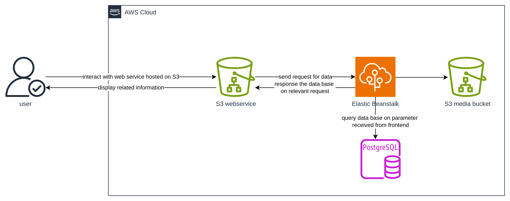

# Infrastructure

## Resourse

- **AWS S3 Bucket**: Serves as the client-side interface for the Udagram application, allowing users to register, log in, and interact with the application.
- **Elastic Beanstak**: Functions as the backend API for the Udagram application, managing the business logic for content handling.
- **Postgres RDS**: A relational database used to store user information and content.

## Integration

- Users can access Udagram through the publicly accessible S3 endpoint to register, log in, and create content.
- The Angular application hosted in the S3 bucket communicates with the backend API via the Elastic Beanstalk domain endpoint.
- Elastic Beanstalk is connected to Postgres RDS for performing data manipulation operations.

## Diagram

