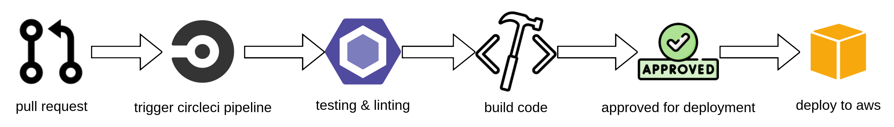

# Pipeline Process

## Resource
1. **Version control**: Github
2. **Continuous Integration Tools**: Circle CI

## Continuous Integration

1. Pull request to master branch will trigger the pipeline
2. The pipeline prepare the node.js environment before starting cofigured steps
3. checkout the code and install dependencies
4. run linting code
5. build the code

## Continous Deployment

1. After the build step is successful, Circle CI will hold the process for a approval
2. Developer/ Team lead give approval for deployment proccess
3. Circle CI repeat the build proccess before starting deploy to the server
4. Deploy the application to AWS

## Pipeline

